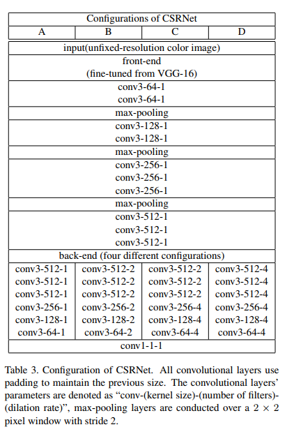
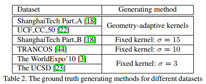
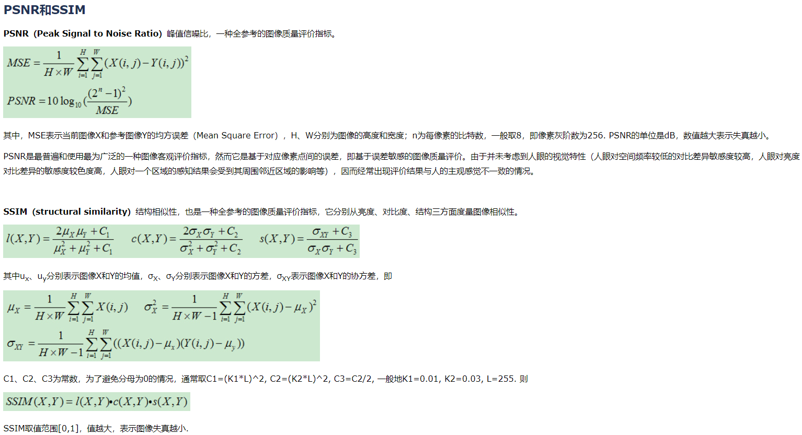

## CSRNet: Dilated Convolutional Neural Networks for Understanding the Highly
Congested Scenes
阅读笔记 by **luo13**  
2020-4-23  

个人感觉这篇论文并不是很突出，只是改了网络结构，而且网络结构的通道数和层数都要多于mcnn，所以效果好了其实也不能说明什么。  
本文贡献：  
1、提出了一系列的空洞卷积网络，兼顾了速度和精度。  
2、引入了新的评价标准PSNR和SSIM

  
网络结构使用了空洞卷积，在不降低分辨率的情况下，增加感受野，基本思路和图像分割比较相似。输出是原图像的八分之一，之后使用双线性插值将其还原至原图大小（这种做法比较粗糙）。   

   
每个数据集使用了不同的设置参数。  

评测标准使用了PSNR和SSIM，这两个指标通常用于图片质量和相似度的评估。主要是为了更好地评估估计的密度图和gt之间的相似度。  
   

思考：能否将PSNR和SSIM整合到loss里面呢。  
