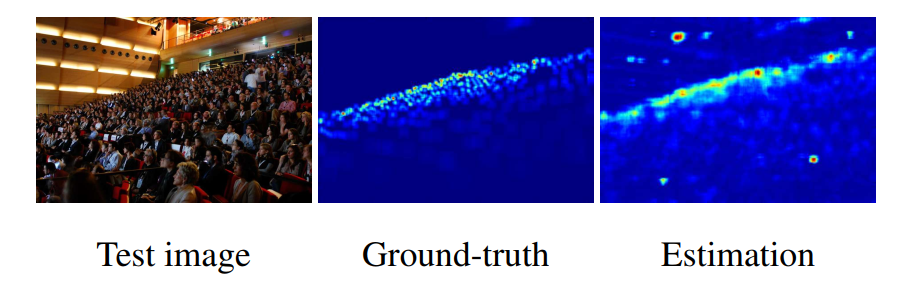
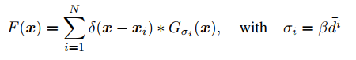
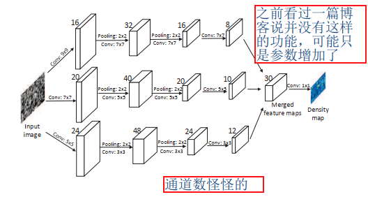
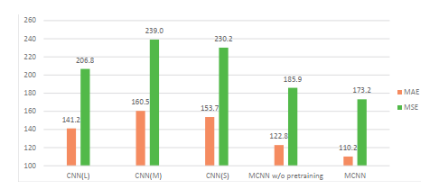
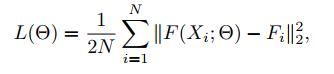
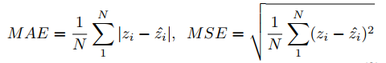
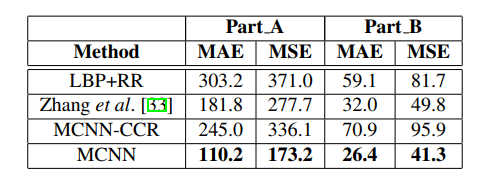

## Single-Image Crowd Counting via Multi-Column Convolutional Neural Network
阅读笔记 by **luo13**  
2020-4-23  

这篇文章不知道是CNN-based密度图估计的第一篇论文。文章贡献：  
1、提出了一个新的人群计数数据集  
2、提出了密度图的概念  
3、设计了一种多列CNN网络用以提取不同尺寸的特征  

  
  
密度图的生成过程是使用高斯核卷积整个图像。beta是超参数，d是k近邻标注点的距离平均值。上图中第二个图片是生成的gt，密集的地方响应高，稀疏的地方响应小（估计稀疏的场景效果可能不会好）。右边的是估计图，感觉效果不太好，背景的噪音也比较多。  

  
网络结构使用了三列CNN并联，训练方式有点麻烦，因为整体从头训练会发散，作者单独训练了每一列，将其作为整体的初始化值再整体训练。  
  
这是每一列的表现，感觉是其实三列单独开来各自的效果也差不多，所以说不好最后合并的提升究竟是真的提取到了不同的特征还是仅仅是因为参数量的提升。  

  
损失函数是l2损失。

  
评测指标一个是l1，另一个是l2，l1代表误差，l2可以代表鲁棒性（即对异常点比较敏感）  

  
论文在shanghaitech的结果，还是比较好的，数据集比较小，感觉很快就会优化得很好了。  

小结：密度图的提出具有标志性意义，后面很多工作其实都依赖于密度图。（不是很确定密度图是不是真的是这篇文章提出来的，看的文章较少，后面再去考证）  

