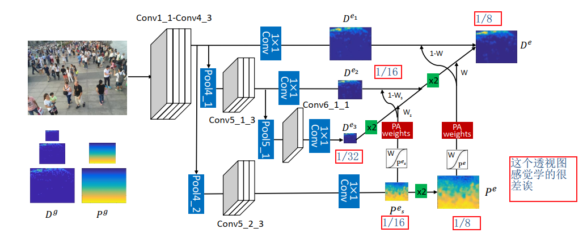
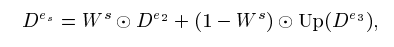

## Revisiting Perspective Information for Efficient Crowd Counting  
Congested Scenes
阅读笔记 by **luo13**  
2020-5-2  

这篇论文是2019年人群计数效果最好的文章，主要的贡献是将perspective map结合到了神经网络中。但感觉文章有些计算细节没有说清楚，整体来说也比较繁琐。  
文章贡献：  
1、提出了一种计算perspective map的方法，并将其结合到神经网络中。  

  
越靠下方，透视图的值越大。  

  
  
  
  
假设符合地面平整，相机不旋转的情况下，计算透视值得方法如上，假设人的身高为1.75，然后在图片上取几个位置，通过线性方程组可以得到C，之后就可以计算出每个位置透视值了。但是因为有些数据集不能看到整个人，作者后面使用了人头的大小，但没有给出相应的推导公式，之后考虑到不是所有数据集都符合上述的假设，作者又提出了一个非线性的计算法方法，但是也没有给出abc的计算公式。  

  
  
  
网络结构也是使用了VGG做backbone，但加入了perspective map的部分。
PAweight采用的是sigmoid函数进行转换，为什么一个要去w另一个取1-w，个人觉得是作者认为大尺寸的特征图注重远处特征，小尺寸特征图注重近处特征，所以取了相反的权重  

  
  
loss比较多，是对每个特征输出都求了损失，而且用了ssim损失。  

  
训练过程采用分布训练。  

小结：结合perspective map的工作以前也有，主要是作者的计算方式以及与网络结合的方法更有效，但是这篇文章感觉挺复杂的，有些关键内容也没讲清楚。  
