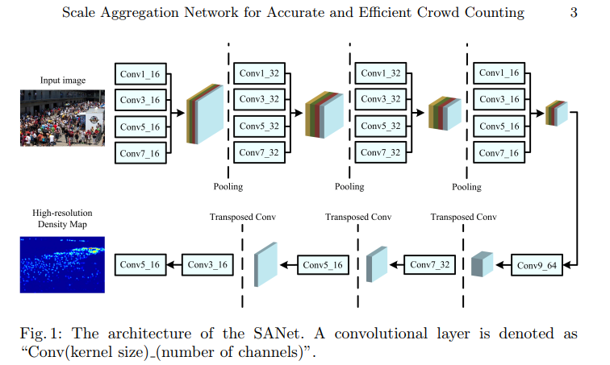
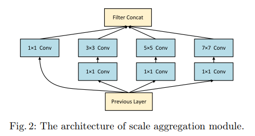
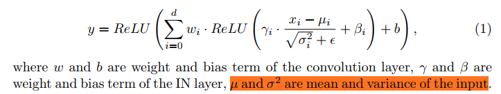
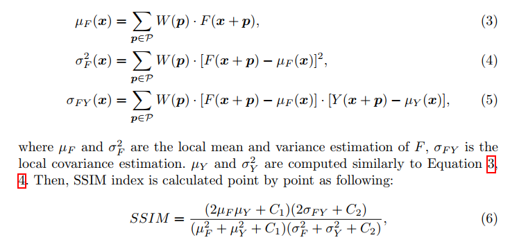
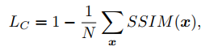
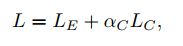
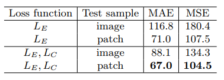

## Scale Aggregation Network for Accurate and Efficient Crowd Counting
阅读笔记 by **luo13**  
2020-4-23  

人群计数的数据集都比较少，训练的时候通常batch也很小，这会导致BN层统计的moving mean和moving variance会不准确，这篇文章关注到了这一问题，同时作者在实验的时候发现使用整张图片训练会导致训练过程不稳定，所以使用了从原图裁剪出patch的方式，并且将SSIM应用到了损失函数中。  

  
网络结构采用了encoder、decoder的U型结构，可以生产更加精细的密度估计图。  
  
sa模块采用Inception的结构，同时使用了，这样可以同时提取到不同尺度的信息，1*1卷积是用来降低输入维数的。  

  
作者考虑到输入batch太小，可能使用BN统计的均值和方差会不准确，所以采用了IN，IN在训练个推理过程中都是使用输入batch的均值和方差，在这一实验中使用IN的效果会更好。  

  
  
  
  
这里相当于对每个像素的领域都计算相应的SSIM，从消融实验上看，效果有所提升。  

同时，作者在训练和测试的过程中都使用patch的方式，不知道在训练测试过程中是否会对图片进行resize，如果有的话，个人觉得这种方式效果会好的原因可能是增大了分辨率。  

思考：为什么全图输入会造成训练发散，人群密度估计是否也存在类别不均衡的问题。  
