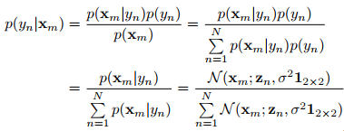

## Bayesian Loss for Crowd Count Estimation with Point Supervision
阅读笔记 by **luo13**  
2020-4-23  

这篇论文半只脚跨出了基于密度图的人群计数范畴，说半只脚是因为还是使用了密度图，但是不使用密度图直接计算损失。  
本文贡献：  
1、提出了基于贝叶斯的损失  
2、增加了背景建模，有效抑制了错误估计的点  

  
  
上图是密度图的计算方法，下图是直接使用密度图计算损失。个人觉得，上图中密度图是累加得到的，这样得出的密度图在高斯分布的交界处可能会不太准确，也会增加背景点的label值，所以这样得到的密度图其实并不能很好反映真实情况。  

  
作者应用贝叶斯公式，将点标注作为先验概率，个人感觉这会让信息更加明确，接近标注点的位置先验较大，远离标注点的先验较小。  
  
通过先验概率和密度图，计算每个标注点的期望（期望为1）  
  
感觉有一个不好的地方是，所有标注点都需要单独计算一次，标注点越多，计算越多（训练的时候）  
  
推理统计密度图的像素值之和即可  

作者在实验中发现，原理标注点的地方也有可能存在较高的响应，故在原来标注点的地方设置背景点，通过增大背景先验，吸收这些异常点  
  
  
  
  
  
  

  
某一点先验的交叉熵的可视化图片，越是密集的地方，点越不明确自己属于哪个标注点。  

小结：上面的操作的代码实现还得研究一下，但这种跳出原来框架的做法感觉很棒
