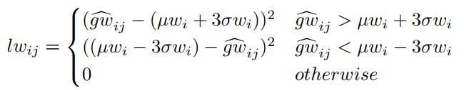

## Point in, Box out: Beyond Counting Persons in Crowds
阅读笔记 by **luo13**  
2020-4-23  

这篇文章的效果并不很好，但是出发点比较新奇，除了能提供密度估计图，还能提供人群头部的大小，虽然我觉得这个信息好像并没有太大的用处。文章贡献：  
1、提供了一种使用伪标签回归头部大小的方法    

  
文章思想是通过伪标签迭代，得到最终的头部边界框。  

既然是使用无监督的方法训练，则必然会存在相应人为设定的规则  
  
  
  
    
xy的损失是真实的数值（虽然说点标注不一定是中心点）  
  
  
长宽的惩罚则采取异常点惩罚的方法，统计相应区域的均值和方差，惩罚那些不落在三倍方差区域的边界框（这里假设了失真较小，图片同一行的头部大小基本一致）  

  
同时，为了减轻网络学习的难度，使用初始化值建立了一个训练难度系数，图片训练的时候会先从简单的数据开始，遍历一遍之后再混合训练。  

小结：无监督学习需要人为设定学习的目标、规则
