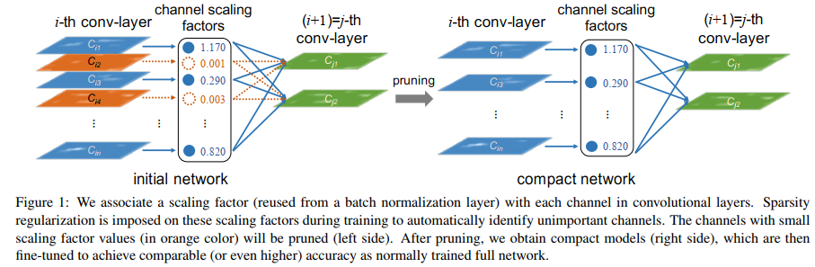

## Learning Efficient Convolutional Networks through Network Slimming
阅读笔记 by **luo13**  
2020-4-5  

这是一篇模型压缩的文章，文章主要贡献：  
1、提供了一种简单的模型压缩方式   
思想很简单，利用网络中BN层的线性变换因子gamma实现对卷积通道的裁剪。  

  
这篇文章提出的模型压缩方法属于对模型结构的裁剪以及稀疏化。  

  
  
裁剪的过程很简单，在训练好一个模型之后，在其损失函数加上一个对BN层线性变换因子gamma的正则化项，使用l1正则化让gamma变得稀疏，收敛后裁剪掉小于阈值的BN层连接的卷积层即可。  
裁剪过后可以对模型进行fine-tune，有时候效果甚至会比剪枝前好。  

  
裁剪的过程可以进行多次  

  
前面提到的BN层都是跟在卷积层后面的，所以可以通过判断BN层的放缩因子大小决定是否要裁剪掉相应的卷积层。但如果BN层在卷积层之前，也就是预激活的情况，BN层则决定前一层卷积层所要裁剪掉的层数。而如果是BN层的输入也是另外的隐藏层的输入，则不能被裁剪掉。如下图右侧的xl是BN层的输入，也是addition的输入。所以这种情况裁剪的比例是比较小的。    
  

  
像VGG这样的PLANT类型的网络裁剪比例是比较大的，其他有跨层连接的网络裁剪比例相对较小，但是也很客观。  

小结：要善于利用网络中现有的条件
