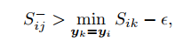
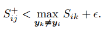

## Multi-Similarity Loss with General Pair Weighting for Deep Metric learning
阅读笔记 by **luo13**

### General Pair Weighting(GPW)
<!-- $${\begin{aligned}
{\frac{\partial L(S,y)}{\partial \theta}}\bigg|_t&={\frac{\partial L(S,y)}{\partial S}}\bigg|_t\frac{\partial S}{\partial \theta}\bigg|_t \\
&=\sum\limits_{i=1}^m\sum\limits_{j=1}^m{\frac{\partial L(S,y)}{\partial S_{ij}}}\bigg|_t\frac{\partial S_{ij}}{\partial \theta}\bigg|_t 
\end{aligned}}$$   -->
.PNG)  
.PNG)  
.PNG)  
(2)由(1)对$\theta$求积分得到  
**(2)其实是对$\theta$作积分，也就是$L(S,y)=F$**
GPW表明，度量学习的损失函数可以转化为一个权重结构公式，分别对postive pair和nagative pair的$S_{ij}$求导并求绝对值可以得到相应的正负权重

### Pair-based Loss Function  

**Contrastive loss**  

nagative pair的相似度要往小于$\lambda$的方向优化，postive pair的相似度往大的方向优化？#TODO  
可以看出正负权重是一样的  
&nbsp;  
**Triplet loss**  
  
优化方向是nagative pair的相似度要小于postive pair的相似度减去一个阈值  
可以看出正负权重是一样的  
&nbsp;  
**Lifted Structure loss**  
  
优化方向是postive pair相似度往大于阈值方向优化，nagative pair的优化方向往0方向优化  
对应的正负权值是  
  
权重越大，证明这个样本包含的信息越多，当其他的postive pairs的相似度都大于$S_{ij}$说明，在这里当前的postive pair是难分样本，应该给与更大的权重
  
权重越大，证明这个样本包含的信息越多，当其他的nagative pairs的相似度都小于$S_{ij}$说明，在这里当前的nagative pair是难分样本，应该给与更大的权重  
&nbsp;  
**Binomial Deviance loss**  
 
优化方向是postive pair相似度往大于阈值方向优化，nagative pair的优化方向往小于阈值方向优化  
&nbsp;  
对应的正负权值是  
  
正负的权值不一样，但其实是contrast_loss的一种改进

### Multiple Similarities
  
相对于negative pair来说，固定anchor。对于case-2若其他的负样本离anchor越近，相对而言当前pair的负样本离anchor更远，更有可能是易分样本。对于case-3，当其他的正样本离anchor越近，相对而言当前pair的负样本离当前anchor更远，更容易是易分样本。  
&nbsp;  
相对于positive pair来说，固定anchor。对于case-2若其他的负样本离anchor越近，相对而言当前pair更容易误分，更有可能是难分样本。对于case-3，当其他的正样本离anchor越近，相对而言当前pair的正样本离当前anchor更远，更容易是难分样本。  
&nbsp;  
 
**MS loss**  
**负样本**  
负样本的对的采样用到了positive similarity，权重用到了self similarity和negative similarity，当其他负样本越靠近当前样本对，negative similarity越小（这时候当前样本对的权重越小），当其他正样本越靠近当前样本对，positive similarity越小。  
  
  
**正样本**  
负样本的对的采样用到了negative similarity，权重用到了self similarity和positive similarity，当其他负样本越靠近当前样本对，negative similarity越小，当其他正样本越靠近当前样本对，positive similarity越小（这时候当前样本对的权重越大）。  
  
  
  
结合了binomial deviance loss 和 lifted structure loss，使得loss的权重与三种相似度都有关系。  
&nbsp;  
