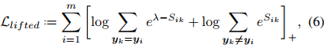

## Multi-Similarity Loss with General Pair Weighting for Deep Metric learning
阅读笔记 by **luo13**

### General Pair Weighting(GPW)
<!-- $${\begin{aligned}
{\frac{\partial L(S,y)}{\partial \theta}}\bigg|_t&={\frac{\partial L(S,y)}{\partial S}}\bigg|_t\frac{\partial S}{\partial \theta}\bigg|_t \\
&=\sum\limits_{i=1}^m\sum\limits_{j=1}^m{\frac{\partial L(S,y)}{\partial S_{ij}}}\bigg|_t\frac{\partial S_{ij}}{\partial \theta}\bigg|_t 
\end{aligned}}$$   -->
.PNG)  
.PNG)  
.PNG)  
(2)由(1)对$\theta$求积分得到  
**(2)其实是对$\theta$作积分，也就是$L(S,y)=F$**
GPW表明，度量学习的损失函数可以转化为一个权重结构公式，分别对postive pair和nagative pair的$S_{ij}$求导并求绝对值可以得到相应的正负权重

### Pair-based Loss Function  

**Contrastive loss**  

nagative pair的相似度要往小于$\lambda$的方向优化，postive pair的相似度往大的方向优化？#TODO  
可以看出正负权重是一样的  
&nbsp;  
**Triplet loss**  
  
优化方向是nagative pair的相似度要小于postive pair的相似度减去一个阈值  
可以看出正负权重是一样的  
&nbsp;  
**Lifted Structure loss**  
  
优化方向是postive pair相似度往大于阈值方向优化，nagative pair的优化方向往0方向优化  
对应的正负权值是  
  
权重越大，证明这个样本包含的信息越多，当其他的postive pairs的相似度都大于$S_{ij}$说明，在这里当前的postive pair是难分样本，应该给与更大的权重
  
权重越大，证明这个样本包含的信息越多，当其他的nagative pairs的相似度都小于$S_{ij}$说明，在这里当前的nagative pair是难分样本，应该给与更大的权重  
&nbsp;  
**Binomial Deviance loss**  
 
优化方向是postive pair相似度往大于阈值方向优化，nagative pair的优化方向往小于阈值方向优化  
&nbsp;  
对应的正负权值是  
  
正负的权值不一样，但其实是contrast_loss的一种改进

### Multiple Similarities
  
对于一个nagative pair，Self-similarity越小越好，Negative relative similarity越大越好，Positive relative similarity越小越好  
对于一个positive pair，Self-similarity越大越好，Negative relative similarity越大越好，Positive relative similarity越小越好  
表格是指下面三种相似性在给一个nagative pair分配权重时是否起到了作用，**感觉表格中MS的P不应该打勾**因为相对于单个权重（正或负来说），只用到了两个，但其实他可以用三个similarities？  
&nbsp;  
对于一个nagative pair
**Self-similarity**  
对应于case1，nagative pair靠的越近，Self-similarity越大
&nbsp;  
**Negative relative similarity**  
对应于case2，随着nagative pair的靠近，nagative pair的Self-similarity增加，Negative relative similarity减小，对应$e^{S_{ij}-S_{ik}}$
&nbsp;  
**Positive relative similarity**  
对应于case3，随着positive pair的靠近，positive pair的Self-similarity增加，Positive relative similarity减小
&nbsp;  
**MS loss**
  
  
  
结合了binomial deviance loss 和 lifted structure loss，使得loss的权重与三种相似度都有关系。  
&nbsp;  
**一些理解**  
本文提出的三种相似度，其实是用来作hard sample mining的。  
权重越大，表示这越可能是一个难分样本  
&nbsp;  
对于negative pair，当其他的negative pairs越靠近anchor，$S_{ik}$越大，$w_{ij}^-$越小，说明相对而言这个pair中的负样本相比于其他negative pairs的负样本离anchor更远，更容易分

&nbsp;  
对于positive pair，当其他的positive pairs越靠近anchor，$S_{ik}$越大，$w_{ij}^-$越大，说明，当前pair的正样本离anchor相比于其他的positive pairs的正样本离anchor更远，更有可能是难分样本
