## 初识自监督
阅读笔记 by **luo13**  
2020-8-23  

学习资料：  
1、[自监督学习专场](https://www.bilibili.com/video/BV1o541167A8?from=search&seid=17829134613897628329)  
2、许鸿斌-2019-10-13-自监督学习与深度估计-单周报告  

涉及论文：  
【1】Video Cloze Procedure for Self-Supervised Spatio-Temporal Learning  
【2】Video Playback Rate Perception for Self-supervised Spatio-Temporal Representation Learning  
【3】Unsupervised Visual Representation Learning by Context Prediction  
【4】Unsupervised Learning of Visual Representations by Solving Jigsaw Puzzles  
【5】Representation Learning by Learning to Count  
【6】UNSUPERVISED REPRESENTATION LEARNING BY PREDICTING IMAGE ROTATIONS  

自监督学习：不使用额外的人工标注，而是使用数据自带的信息作为监督信号，自监督学习可以在数据稀缺的时候，作为目标任务的代理任务，达到预训练的效果。也可以直接用作目标任务，如使用双目信息做单目深度估计。与MAML的区别，都能产生好的初始化参数，但MAML是使用meta-learning思想进行训练的。  

【1】通过采样视频帧，并将采样的视频帧经过数据增强后，重新放入原来的位置，让网络学习这一段视频使用了哪些数据增强，通过这样的分类代理任务让网络学习到视频的内在特征，从而为后续目标任务提供一个好的初始化参数。  
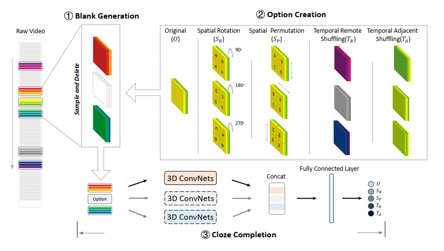   
从视频中抽取一段视频序列，再从序列中抽取一段子序列，对子序列使用数据增强，可以是旋转，空间交换，与序列外的等长序列交换，序列内交换。然后将这段序列三个子序列分别输入参数共享的网络，得到特征concatenate之后经过FC层判断出这段序列使用的数据增强模式。一个视频可以被抽取多段序列。  

【2】  
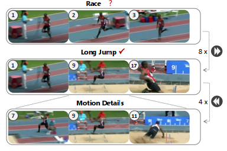   
motivation，通过不同播放速率的视频可以分析出视频中的动作，所以使用不同速率的视频，应该能让网络学习到视频帧中的内在信息。

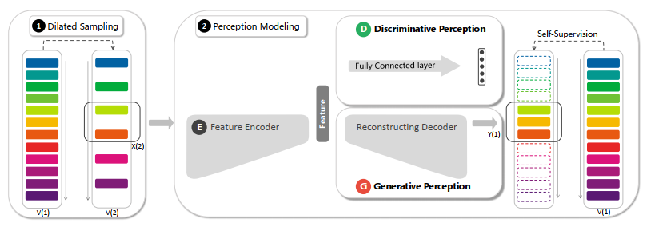   
分成两个任务：判别任务和生成任务。判别任务是判别采样后的视频序列的播放倍速，生成任务是是要生成因采样缺失的视频帧，生成的帧数可以多于原视频缺失的帧数，也可以少于原视频的帧数。（多于原视频帧数的时候，在原视频基础上采用插值得到新的一帧，但是直接插值可以得到正常的画面吗？还有这样的话应该在哪个位置插值呢？文中没有详细介绍。）  

【3】
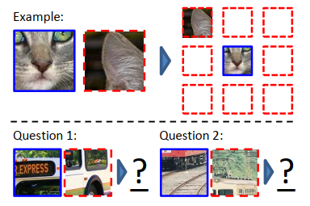   
给定图中一个区域，可以定出这一区域的八邻域  
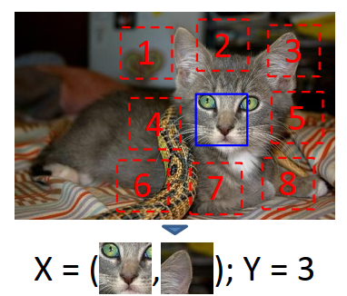   
使用给定区域和八邻域中的一个组成样本对，使用人为设定的八邻域标号作为样本对的标签
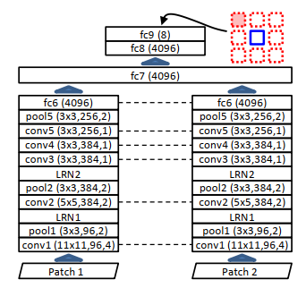   
网络结构是一个类似siamese网络，但是有些网络层并不是共享的  

【4】
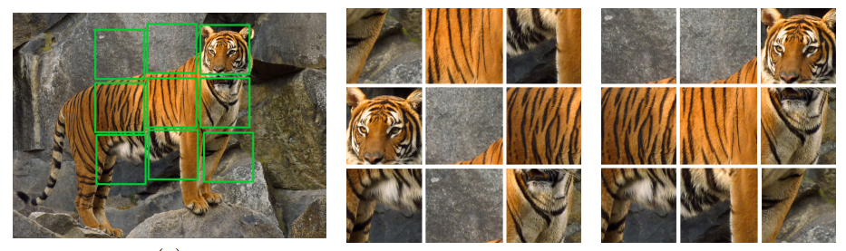   
这篇文章是上一篇的升级版本，考虑到了九个patchs的顺序问题

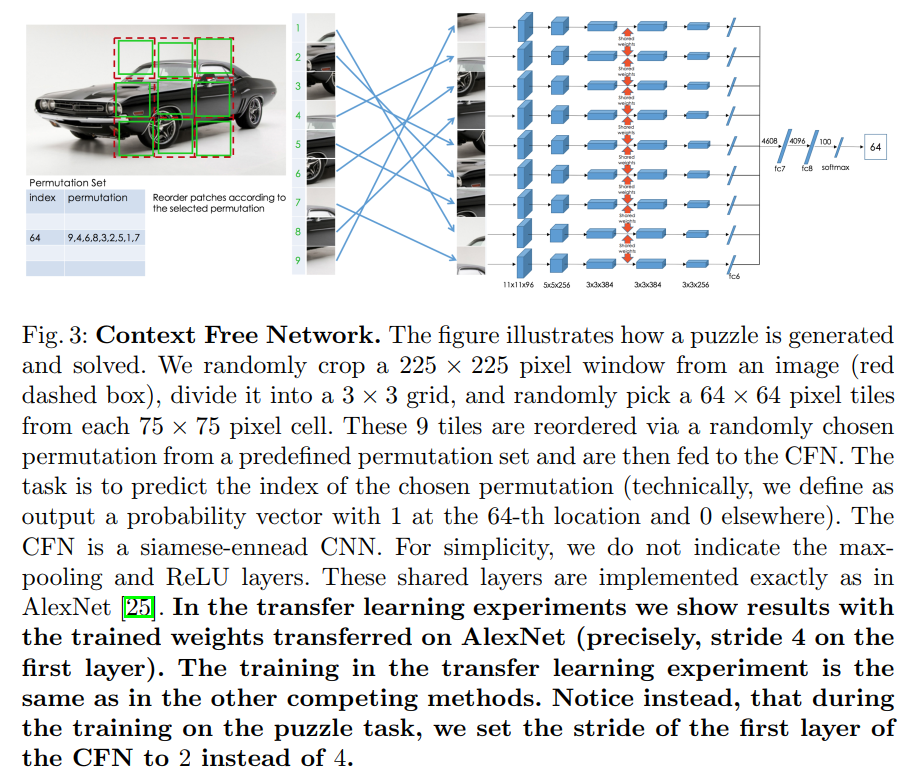   
预先设定好64种排列顺序，每次随机抽取之后进行分类  

【5】
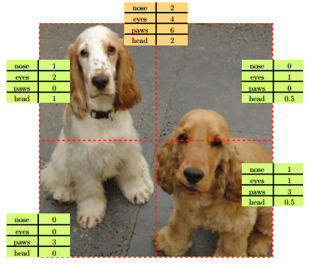   
这篇文章主要借鉴了count的思想，即区域的count之和与整体的count是相等的
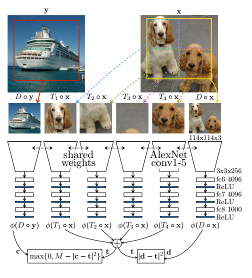   
但在自监督学习中，如何构建count的目标呢？作者将部分区域和整体一起输入网络，比较两者之间的差别，让网络学习内在的图像特征。但这种方式很可能让网络一直输出0，所以作者加入了一个无关类别的图像，作用是使无关图像和训练目标图像差距拉大，也避免了loss为0的情况。（但是感觉这样做很容易让loss变得不稳定）  
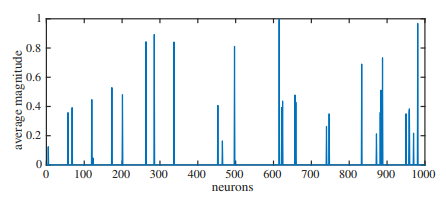   
文章中训练好的网络对ImageNet中1000类的响应高低，结果比较稀疏，应用时需要根据目标任务进行微调。  

【6】
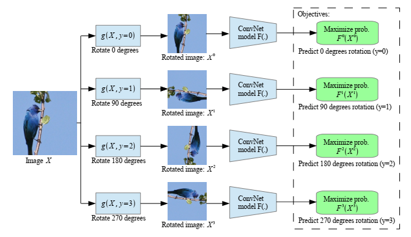  
对图像进行旋转，旋转之后判断其方向（要是有一些图片本来就是旋转的怎么办？） 
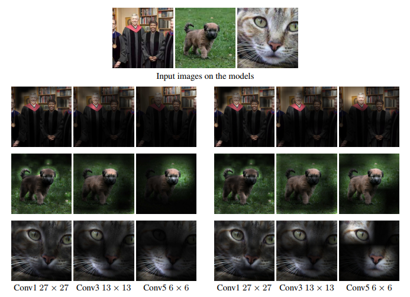   
左边是有监督的网络响应图，右边是自监督的网络激活效果  
